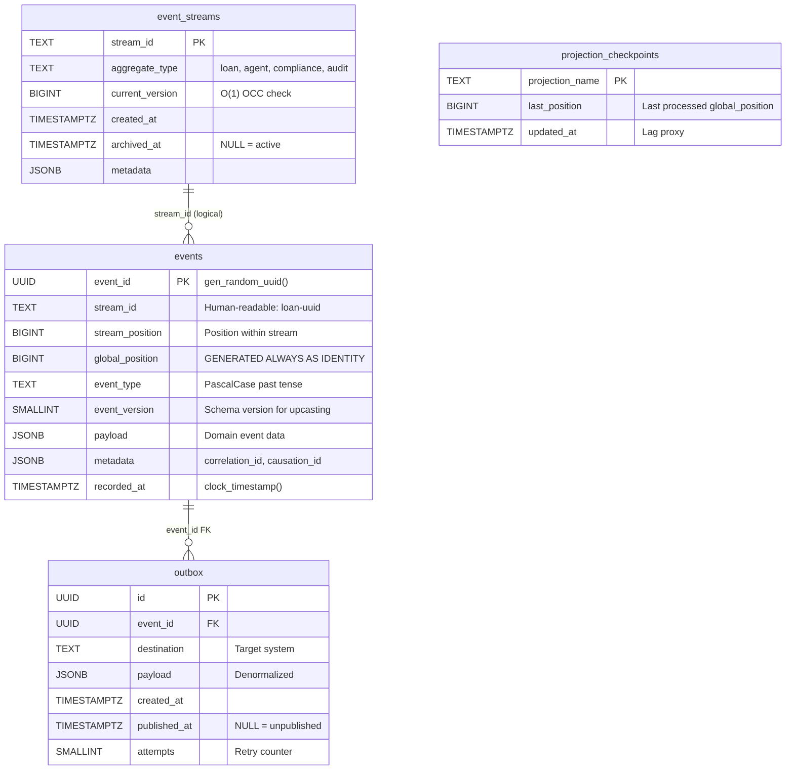
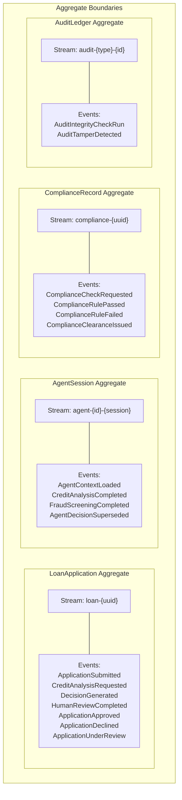
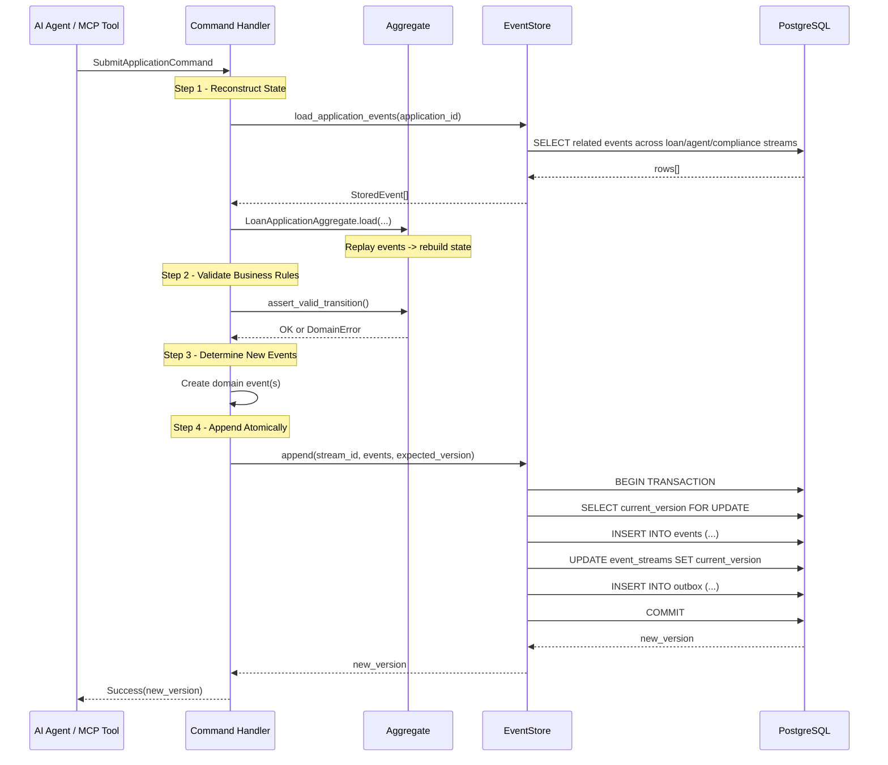
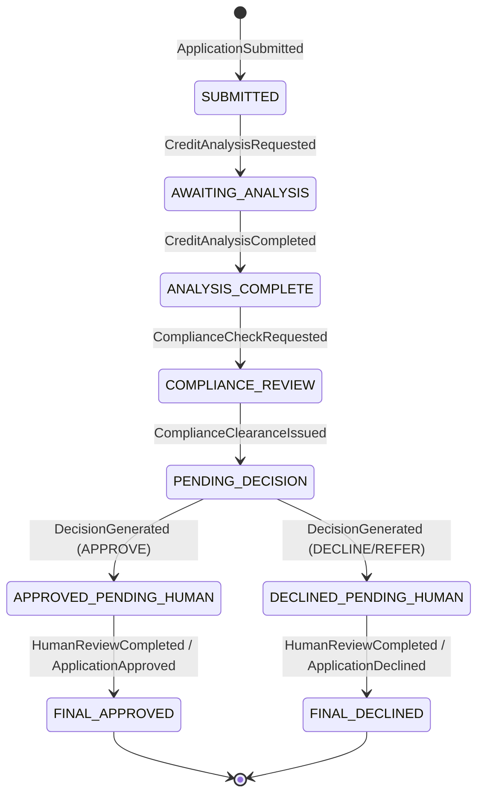
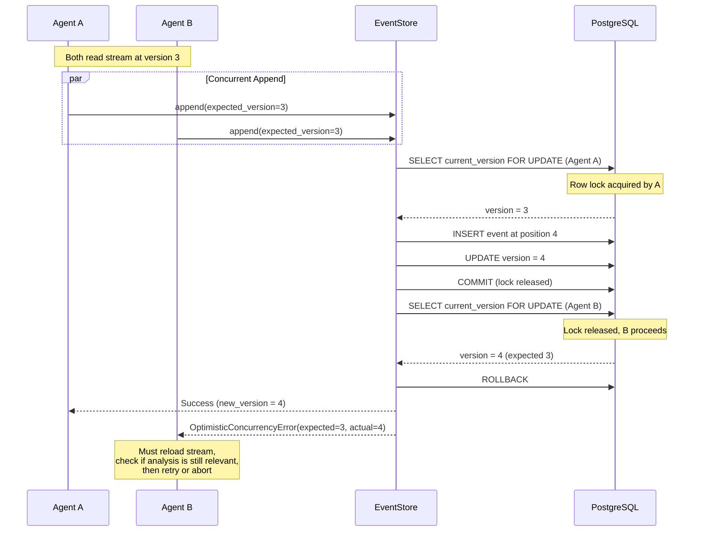
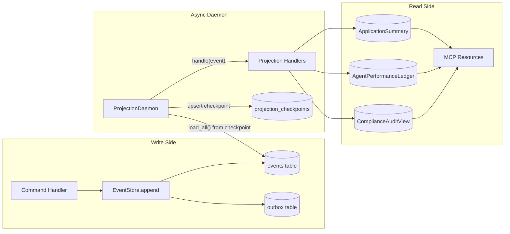

# TRP1 Ledger — Final Submission Report

**Candidate Submission — Final Deadline: March 25, 2026**

---

## 1. DOMAIN_NOTES.md (Phase 0 Deliverable)

> **Assessed independently of code.** "A candidate who writes excellent code but cannot reason about the tradeoffs is not ready for enterprise event sourcing work." — Challenge Specification, Phase 0.

---

### Question 1 — EDA vs ES Distinction

**Question:** A component uses callbacks (like LangChain traces) to capture event-like data. Is this Event-Driven Architecture (EDA) or Event Sourcing (ES)? If redesigned with The Ledger, what exactly would change?

#### Analysis

LangChain-style component callbacks are **Event-Driven Architecture (EDA)**, not Event Sourcing.

The distinction is mathematical (Manual Part I §1.1, "The Mathematical Distinction"):

- **ES:** `S_t = f(S_0, [e_1, e_2, ..., e_t])` — state IS the complete event history. Current state is derived by replaying all events from the initial state.
- **EDA:** `S_t = S_{t-1} + Δ` — events trigger state updates. Events are messages, not the source of truth.

LangChain callbacks fire notification events that are consumed by subscribers (loggers, tracers, analytics). The events notify observers of something that happened, but the system's authoritative state lives in mutable in-memory objects — the LangChain `Chain`, `Agent`, and `Memory` objects. Callbacks are side effects, not the ground truth.

**The "What If" Test (Manual Part I §1.2, Table 1):** "What happens if the message bus crashes and loses 100 events?" In the LangChain callback system: those 100 trace entries are lost forever. The system continues operating — the in-memory state is unaffected — but you can never reconstruct what happened during that window. You cannot reproduce the agent's decisions, audit its reasoning, or recover its context. In an Event Sourcing system: losing 100 events is catastrophic because the events ARE the state. But this loss is prevented by ACID guarantees on the append — the events are stored in PostgreSQL with transactional integrity. They cannot be "lost" by a bus crash.

#### What Would Change

If redesigned with The Ledger:

1. **Callbacks → `EventStore.append()` calls.** Every agent action, tool invocation, and reasoning step would be an event appended to a stream, not a fire-and-forget callback.

2. **LangChain trace object → AgentSession stream.** The ephemeral in-memory trace would be replaced by a durable `agent-{id}-{session}` stream in the event store. Each session has `AgentContextLoaded` as its first event (Gas Town pattern).

3. **In-memory state → `load()` + event replay.** Agent state would not live in mutable Python objects. On restart, the agent replays its event stream to reconstruct its context. This is the Gas Town pattern: "the event store IS the agent's memory" (Manual Part II Cluster E, "Agent Memory via Event Replay").

4. **Mutable chain outputs → Immutable decision events.** Each model output becomes a `CreditAnalysisCompleted` or `DecisionGenerated` event with full causal provenance: `model_version`, `input_data_hash`, `session_id`.

**What you gain:** Auditability (every decision is a recorded fact), reproducibility (replay events to reconstruct any past state), crash recovery (agent restarts from last event, not from scratch), and temporal queries ("what was the agent's context at T=15:30?").

---

### Question 2 — Aggregate Boundary Choice

**Question:** Identify one alternative boundary you considered and rejected. What coupling problem does your chosen boundary prevent?

#### The Chosen Boundaries

The system uses four aggregates, each owning independent business invariants:

| Aggregate        | Stream Format          | Core Invariant                            |
| ---------------- | ---------------------- | ----------------------------------------- |
| LoanApplication  | `loan-{uuid}`          | Application lifecycle state machine       |
| AgentSession     | `agent-{id}-{session}` | Gas Town context requirement              |
| ComplianceRecord | `compliance-{uuid}`    | Mandatory check completion                |
| AuditLedger      | `audit-{type}-{id}`    | Append-only, cross-stream causal ordering |

#### The Rejected Alternative

**Considered and rejected:** Merging `ComplianceRecord` into `LoanApplication` as a sub-entity.

This is the most intuitive boundary mistake. Compliance checks "belong to" a loan application, so it seems natural to model them as part of the `LoanApplication` aggregate — having `ComplianceRulePassed` and `ComplianceRuleFailed` events in the `loan-{uuid}` stream.

#### The Coupling Problem

Using the concurrency cost framing from Manual Part II Cluster A, "Aggregate" Note:

**If merged:** Every compliance rule evaluation (potentially 20+ checks per application, running in parallel across multiple compliance agents) contends for the `LoanApplication` stream. Each check must `load_stream("loan-{uuid}")`, validate, and `append()` with `expected_version`. With 20 checks running simultaneously:

- Check 1 reads version 5, appends at expected_version=5 → succeeds, stream now at 6.
- Check 2 reads version 5, appends at expected_version=5 → **OptimisticConcurrencyError**.
- Check 3 reads version 5, appends at expected_version=5 → **OptimisticConcurrencyError**.
- ... up to 19 retries needed for a single compliance run.

This generates **up to 19 `OptimisticConcurrencyError`s per compliance run per application** — not because of legitimate business conflicts, but because of an artificial contention introduced by merging boundaries.

**With separate boundaries:** Compliance checks write to `compliance-{uuid}` stream. The loan application reads compliance state only when it needs to enforce Rule 5 (compliance dependency for approval). No contention between compliance check events and loan lifecycle events.

#### Missing Events and Their Aggregates

The 4 identified missing events each belong to a specific aggregate for consistency boundary reasons:

1. **ApplicationUnderReview** → LoanApplication — it records a state transition in the loan lifecycle.
2. **AgentDecisionSuperseded** → AgentSession — it records a fact about an agent's decision being overridden; the session owns the decision.
3. **ComplianceClearanceIssued** → ComplianceRecord — it records the aggregate compliance outcome; the compliance aggregate owns this invariant.
4. **AuditTamperDetected** → AuditLedger — it records a fact about audit integrity; the audit aggregate owns integrity.

Each event is in the aggregate that owns the business invariant it records. Moving any of them to a different aggregate would mix consistency requirements.

---

### Question 3 — Concurrency in Practice

**Question:** Two AI agents simultaneously process the same loan application and both call `append` with `expected_version=3`. Trace the exact sequence of operations.

#### Step-by-Step Trace

**Setup:** Stream `loan-app-001` is at version 3 (3 events: `ApplicationSubmitted`, `CreditAnalysisRequested`, and a third event). Agent-A and Agent-B are both credit analysis agents that have independently completed their analysis.

```
T=0  Agent-A: SELECT current_version FROM event_streams
             WHERE stream_id = 'loan-app-001' FOR UPDATE
             → returns 3
     Agent-B: (blocked — FOR UPDATE row lock held by Agent-A's transaction)

T=1  Agent-A: INSERT INTO events (stream_id, stream_position, ...)
             VALUES ('loan-app-001', 4, ...)
             UNIQUE constraint check on (stream_id=loan-app-001, stream_position=4)
             → passes (no existing row with position 4)

T=1  Agent-A: UPDATE event_streams SET current_version = 4
             WHERE stream_id = 'loan-app-001'

T=1  Agent-A: INSERT INTO outbox (event_id, destination, payload) ...

T=1  Agent-A: COMMIT → transaction completes, row lock released.
             Stream 'loan-app-001' is now at version 4.

T=2  Agent-B: (lock released) SELECT current_version FOR UPDATE
             → returns 4 (Agent-A already committed)

T=2  Agent-B: current_version (4) != expected_version (3)
             → ROLLBACK

T=2  Agent-B: EventStore raises OptimisticConcurrencyError(
                stream_id='loan-app-001',
                expected=3,
                actual=4,
                suggested_action='reload_stream_and_retry'
             )

T=3  Agent-B MUST:
     1. Reload the stream at version 4
     2. Examine the new event at position 4
     3. Decide if its own analysis is still relevant given the new event
     4. If still relevant: retry with expected_version=4
     5. If superseded: abort and log the reason
```

#### Why FOR UPDATE Row Lock

"100 loans with 4 agents each = 400 concurrent writers. A table lock would serialize all of them. Row-level lock only prevents concurrent writes to the SAME stream — different loans proceed independently." (Manual Part II Cluster A, "Optimistic Concurrency Control")

A `SELECT ... FOR UPDATE` on `event_streams WHERE stream_id = $1` locks only that one row. Agent-C processing `loan-app-002` is completely unaffected by the Agent-A / Agent-B contention on `loan-app-001`. This is the key insight: OCC contention is per-stream, not per-table.

#### Alternative Path: UniqueViolation

If both transactions proceed simultaneously (without the FOR UPDATE path), the database's UNIQUE constraint on `(stream_id, stream_position)` catches the conflict:

```
T=1  Agent-A: INSERT (stream_id='loan-app-001', stream_position=4) → succeeds
T=1  Agent-B: INSERT (stream_id='loan-app-001', stream_position=4)
             → psycopg.errors.UniqueViolation
T=2  EventStore catches UniqueViolation → OptimisticConcurrencyError
```

The UNIQUE constraint is the safety net; the FOR UPDATE check is the preferred fast path. Both ensure correctness. The implementation handles both scenarios.

#### On Retry

"On retry, the agent must check whether the analysis it was about to submit is still relevant given the new events — it may have been superseded." (Manual Part II Cluster A, "OCC" Note)

Agent-B must NOT blindly retry. It must reload the stream, see that Agent-A already submitted a `CreditAnalysisCompleted` event, and then determine: is Agent-B's analysis still needed? If Agent-A's analysis is authoritative, Agent-B should emit an `AgentDecisionSuperseded` event (one of our missing events) and exit gracefully.

---

### Question 4 — Projection Lag and Its Consequences

**Question:** A loan officer queries "available credit limit" immediately after an agent commits a disbursement event. They see the old limit. What does the system do?

#### Two Consistency Models

This is a fundamental consequence of CQRS:

- **Write side (event store):** Strongly consistent, ACID guaranteed. When `EventStore.append()` returns, the event is durably stored and the stream version is atomically updated. There is zero ambiguity about the event's existence.

- **Read side (projections):** Eventually consistent, lag = time since last checkpoint. Projections are updated asynchronously by the daemon. Between the event being appended and the projection being updated, there is a window where the read model is stale.

> "Event sourcing is NOT eventually consistent — only projections are." (Manual Part II Cluster D, "Eventual Consistency vs. Strong Consistency")

#### The SLO

- `ApplicationSummary` projection lag SLO: **p99 < 500ms**
- `ComplianceAuditView` projection lag SLO: **p99 < 2000ms**

The loan officer sees the old credit limit for up to 500ms after the disbursement event is committed. This is the projection lag window.

#### What the System Does

The UI timing problem must be explicitly designed for (Manual Part II Cluster D, "Eventual Consistency" Note). Three approaches, any of which can be used:

**Option A — Polling with write-side confirmation:**
After the command completes, the UI receives the write-side confirmation including `last_event_at` (the `recorded_at` timestamp of the just-committed event). The UI polls `GET /applications/{id}` until the projection's `last_event_at` matches or exceeds the write-side timestamp. Typical resolution: 100-300ms. SLO guarantees resolution within 500ms.

**Option B — Optimistic UI update:**
The command response includes the new credit limit directly — this is the write-side value, computed in the command handler, not from the projection. The UI optimistically updates the display using this value immediately. When the projection catches up, it confirms the same value. This eliminates perceived lag entirely.

**Option C — Inline projection for credit limit:**
For this specific high-value field, use an inline (synchronous) projection that updates the credit limit in the same transaction as the event write. Higher write latency (adds ~5ms to the transaction), but guarantees read-after-write consistency for this one field. Other fields still use async projection.

**Recommended approach:** Option B for the UI layer (immediate feedback), with Option A as a fallback for consistency-critical operations (e.g., another agent reading the credit limit to make a decision — it must wait for the projection to catch up).

#### Communication to UI

The API response must include projection lag metadata:

```json
{
    "application_id": "loan-001",
    "credit_limit": 500000,
    "projection_lag_ms": 150,
    "data_as_of": "2026-03-16T12:00:00.150Z",
    "last_event_at": "2026-03-16T12:00:00.000Z"
}
```

This enables the UI to display a "data may be up to Xms behind" indicator when lag exceeds a threshold (e.g., 200ms). The loan officer knows the data is stale and can refresh.

---

### Question 5 — The Upcasting Scenario

**Question:** `CreditDecisionMade` defined in 2024 with `{application_id, decision, reason}`. In 2026 it needs `{model_version, confidence_score, regulatory_basis}`. Write the upcaster.

#### The Upcaster

```python
@registry.register("CreditDecisionMade", from_version=1)
def upcast_credit_decision_v1_to_v2(payload: dict) -> dict:
    return {
        **payload,
        "model_version": _infer_model_version(payload.get("recorded_at")),
        "confidence_score": None,
        "regulatory_basis": _infer_regulatory_basis(payload.get("recorded_at")),
    }


def _infer_model_version(recorded_at: str | None) -> str:
    """
    Infer model version from timestamp. Known deployment timeline:
      pre-2025-01-01:              "credit-model-v1.x-legacy"
      2025-01-01 to 2025-06-30:    "credit-model-v2.0"
      2025-07-01 onwards:          "credit-model-v2.2"

    Estimated error rate: ~15% for events in Q3 2025 (model transition
    period when multiple versions were deployed simultaneously in a
    canary rollout).
    """
    if not recorded_at:
        return "credit-model-v1.x-legacy"

    from datetime import datetime
    if isinstance(recorded_at, str):
        ts = datetime.fromisoformat(recorded_at)
    else:
        ts = recorded_at

    if ts.year < 2025:
        return "credit-model-v1.x-legacy"
    elif ts < datetime(2025, 7, 1, tzinfo=ts.tzinfo):
        return "credit-model-v2.0"
    else:
        return "credit-model-v2.2"


def _infer_regulatory_basis(recorded_at: str | None) -> str:
    """
    Infer the regulatory framework version active at the time of the decision.
    """
    if not recorded_at:
        return "Basel-III-2024-Q4"

    from datetime import datetime
    if isinstance(recorded_at, str):
        ts = datetime.fromisoformat(recorded_at)
    else:
        ts = recorded_at

    if ts.year < 2025:
        return "Basel-III-2024-Q4"
    elif ts < datetime(2025, 7, 1, tzinfo=ts.tzinfo):
        return "Basel-III-2025-Q1"
    else:
        return "Basel-IV-2025-Q3"
```

#### Inference Strategy: `confidence_score`

**`confidence_score` is set to `None` — not inferred, not defaulted to 0.5.**

This is a deliberate decision. Justification from Manual Part II Cluster C, "Upcaster" Note: "Never fabricate a value that will be treated as accurate data."

**Why not fabricate?** If `confidence_score` were fabricated as `0.75`:

- A downstream compliance system would treat that value as a measured model output and include it in regulatory reports.
- An auditor examining a 2024 decision would see a confidence score that never existed in the original model output.
- Model performance analysis for 2024 would include fabricated data points, corrupting statistical analyses.
- The audit trail — the primary purpose of the entire Ledger — would contain provably false information.

**`None` is honest.** It communicates: "this field did not exist when the event was created." Any downstream system can handle `None` with an explicit fallback strategy, rather than silently consuming a fabricated number.

#### Inference Strategy: `model_version`

Unlike `confidence_score`, `model_version` CAN be inferred — but with acknowledged error:

- **For pre-2025 events:** Inference is reliable. Only v1.x was deployed.
- **For 2025 H1 events:** Inference is reliable. Only v2.0 was in production.
- **For Q3 2025 events:** Error rate ~15%. Multiple versions were deployed simultaneously during the canary rollout. An event timestamped 2025-07-15 might have been produced by v2.0 (still in production for some segments) or v2.2 (canary deployment).

#### Quantifying Consequences

For `model_version`, an incorrect inference means compliance reports attribute a 2024 decision to the wrong model version. Error rate ~15% in the 6-month transition window. Downstream: model performance analysis for that period is unreliable.

**Mitigation:** Flag inferred fields with inference metadata. The upcasted event's metadata should include:

```json
{
    "inferred_fields": ["model_version", "regulatory_basis"],
    "inference_confidence": {
        "model_version": 0.85,
        "regulatory_basis": 0.95
    },
    "inference_method": "timestamp_based_deployment_timeline"
}
```

This enables downstream systems to distinguish between measured values (from v2 events) and inferred values (from upcasted v1 events), and to weight them appropriately in analysis.

---

### Question 6 — The Marten Async Daemon Parallel

**Question:** Marten 7.0 has distributed projection execution across nodes. How do you achieve the same in Python? What coordination primitive? What failure mode?

#### The Coordination Primitive: PostgreSQL Advisory Locks

```python
async def try_acquire_projection_lock(
    conn: psycopg.AsyncConnection,
    projection_name: str,
) -> bool:
    """
    Attempt to acquire a PostgreSQL advisory lock for a projection.
    Non-blocking: returns True if lock acquired, False if another node holds it.
    """
    result = await conn.execute(
        "SELECT pg_try_advisory_lock(hashtext($1))",
        (projection_name,),
    )
    row = await result.fetchone()
    return bool(row and row[0])
```

**Why advisory locks?** They are:

- **Lightweight:** No table or row contention. Advisory locks live in shared memory.
- **Session-scoped:** Automatically released when the database connection drops (node crash = instant release).
- **Non-blocking:** `pg_try_advisory_lock` returns immediately, unlike `pg_advisory_lock` which waits.
- **Database-native:** No external coordinator (ZooKeeper, etcd, Redis) required. The database is already there.

#### Architecture

On daemon startup, each node attempts to acquire advisory locks for each projection:

```python
class DistributedProjectionDaemon:
    async def start(self):
        for projection in self._projections.values():
            acquired = await try_acquire_projection_lock(
                self._conn, projection.name
            )
            if acquired:
                # This node processes this projection
                self._active_projections.append(projection)
                logger.info("projection_lock_acquired",
                           projection=projection.name, node=self._node_id)
            else:
                # Another node holds this projection — standby
                self._standby_projections.append(projection)
                logger.info("projection_lock_standby",
                           projection=projection.name, node=self._node_id)
```

Distribution across 3 nodes with 3 projections:

- Node A: acquires `ApplicationSummary` lock → processes it
- Node B: acquires `AgentPerformanceLedger` lock → processes it
- Node C: acquires `ComplianceAuditView` lock → processes it
- Each node is standby for the other two projections

#### The Failure Mode Guarded Against

**Without coordination:** Two daemon instances processing the same projection simultaneously would:

1. Both read the same `last_position` from `projection_checkpoints` (e.g., position 100).
2. Both fetch the same batch of events (positions 101-200).
3. Both apply the same events to the projection table — producing **duplicate updates**.
4. Both update the checkpoint. Due to transaction isolation, one node's checkpoint update might overwrite the other's with a **lower value** — because they read the same starting position. This causes events to be **reprocessed** on the next cycle.
5. The projection table now contains duplicated or corrupted state.

**With advisory locks:** Only one node processes each projection at a time. The standby node polls for the lock periodically. If the active node crashes, PostgreSQL releases the advisory lock automatically when the connection drops. The standby acquires the lock within the next poll cycle (typically < 1 second) and resumes from the last checkpoint.

#### Idempotency Requirement

Even with locking, projection handlers must be idempotent (Manual Part II Cluster B, "Projection Checkpoint / Daemon Checkpoint"). Advisory locks prevent the common case of duplicate processing, but at-least-once delivery still applies in edge cases:

1. Node processes batch 101-200.
2. Node updates projection table (positions 101-200 applied).
3. Node crashes BEFORE updating `projection_checkpoints`.
4. Standby node acquires lock, reads checkpoint = 100, reprocesses 101-200.

The projection handler must tolerate this reprocessing. For `ApplicationSummary`, this means using `INSERT ... ON CONFLICT DO UPDATE` (upsert) rather than `INSERT` — replaying the same event produces the same state.

The checkpoint update and projection update occurring in the SAME transaction mitigates this (Manual Part IV §4.1, "projection_checkpoints" Design Note), but idempotency remains the defense in depth.

---

### Missing Events — Justification

The Event Catalogue is "intentionally incomplete" (Challenge Doc p.6). Four missing events were identified:

#### 1. `ApplicationUnderReview` (LoanApplication, v1)

**Gap:** The state machine transitions from `PENDING_DECISION` to `APPROVED_PENDING_HUMAN` or `DECLINED_PENDING_HUMAN`, but there is no event that explicitly records WHY this application went to human review. Without it, to determine "all applications that were referred for human review and why" requires inferring from `DecisionGenerated.recommendation = 'REFER'` — which is computation, not a recorded fact.

**Value:** Enables direct audit queries: "Show me all applications that went to human review in Q1 2026, grouped by reason." Without this event, the same query requires replaying `DecisionGenerated` events and filtering — which is an O(n) scan instead of an O(1) indexed lookup.

#### 2. `AgentDecisionSuperseded` (AgentSession, v1)

**Gap:** Business Rule 3 (model version locking) states that no further `CreditAnalysisCompleted` events may be appended "unless the first was superseded by a HumanReviewOverride." But there is no event that records this supersession. Without it, the aggregate must infer supersession from the presence of `HumanReviewCompleted.override = true` — mixing the human review fact with the supersession fact.

**Value:** Records the causal link: "Agent-A's decision was superseded because Human-X overrode it." Enables tracking of agent reliability: "How often are Agent-A's decisions superseded?"

#### 3. `ComplianceClearanceIssued` (ComplianceRecord, v1)

**Gap:** The catalogue has `ComplianceRulePassed` and `ComplianceRuleFailed` for individual checks, but no event records the aggregate compliance outcome. Without it, determining "is this application compliance-clear?" requires replaying all rule events and computing `set(required) ⊆ set(passed)` every time.

**Value:** This is a recorded fact, not a computed state. It enables the `LoanApplication` aggregate to enforce Rule 5 (compliance dependency) by checking for the existence of this event, rather than cross-aggregate set computation. It also provides a clear trigger for the state machine transition from `COMPLIANCE_REVIEW` to `PENDING_DECISION`.

#### 4. `AuditTamperDetected` (AuditLedger, v1)

**Gap:** `AuditIntegrityCheckRun` records successful integrity checks. But there is no event for when a check FAILS (detects tampering). Tamper detection is a critical regulatory event that must not be a silent absence-of-success inference.

**Value:** In a regulatory system, tamper detection MUST be explicit, recorded, and alertable. The absence of a successful `AuditIntegrityCheckRun` could mean: (a) no check was run, or (b) a check ran and found tampering. These are fundamentally different facts that require different responses. `AuditTamperDetected` removes the ambiguity and enables immediate alerting workflows.

---

## 2. DESIGN.md — Architecture & Tradeoff Analysis

### 2.1 Aggregate Boundaries

| Aggregate        | Stream Format                     | Invariant Owned                                                              |
| ---------------- | --------------------------------- | ---------------------------------------------------------------------------- |
| LoanApplication  | `loan-{application_id}`           | Lifecycle transitions, human decision outcome, contributing-session validity |
| AgentSession     | `agent-{agent_id}-{session_id}`   | Gas Town precondition: no agent decision before context declaration          |
| ComplianceRecord | `compliance-{application_id}`     | Required-rule completion, per-rule pass/fail state, clearance issuance       |
| AuditLedger      | `audit-{entity_type}-{entity_id}` | Integrity-check chain continuity and tamper detection                        |

The main rejected alternative was folding `ComplianceRecord` into `LoanApplication`. That would force every compliance rule result to contend on the loan stream and turn parallel checks into artificial optimistic-concurrency failures. Keeping compliance separate means credit, fraud, and compliance work can progress independently while the loan aggregate still observes the resulting facts through cross-stream replay.

### 2.2 Projection Strategy

All projections run asynchronously behind `ProjectionDaemon`. The write path stays fast and projections can be rebuilt by replaying the immutable log.

| Projection             | Read Purpose                              | SLO                           |
| ---------------------- | ----------------------------------------- | ----------------------------- |
| ApplicationSummary     | Operator dashboard and application lookup | lag under 500ms               |
| AgentPerformanceLedger | Agent/model analytics                     | no hard real-time requirement |
| ComplianceAuditView    | Regulatory examination and time-travel    | lag under 2000ms              |

**Compliance Snapshot Strategy:** `ComplianceAuditView` uses three tables: `compliance_audit_view` (current full state), `compliance_audit_events` (immutable per-event audit log), and `compliance_audit_snapshots` (periodic state snapshots keyed by source event). `get_compliance_at(application_id, timestamp)` first loads the newest snapshot at or before `timestamp`, then replays only the later `compliance_audit_events`. Snapshots are written every three compliance events and on terminal-style events such as `ComplianceClearanceIssued`. This keeps temporal reads bounded without sacrificing exact replay semantics.

**Zero-Downtime Rebuild:** `ComplianceAuditProjection.rebuild_from_scratch()` rebuilds into shadow tables, swaps them atomically, then drops the old tables.

### 2.3 Concurrency, Retry Budget, and Projection Fault Tolerance

**Event Store OCC:** The write path uses two layers: (1) `SELECT ... FOR UPDATE` on `event_streams`, (2) `UNIQUE(stream_id, stream_position)` on `events`. The loser receives `OptimisticConcurrencyError` with `suggested_action = "reload_stream_and_retry"`.

**Expected OCC Rate:** Under 100 concurrent applications with four agents each, most writes hit different streams, so inter-stream contention is effectively zero. Real conflicts should remain low, typically below two conflicts per loan lifecycle.

**Caller Retry Budget:** Max retries: 3. Backoff: 50ms, 100ms, 200ms. After budget exhaustion: return the typed concurrency error to the caller.

**Projection Retry Budget:** Projection failures are tracked in `projection_failures`. Each `(projection_name, global_position)` pair carries a retry counter. The daemon retries a failing event up to `max_retries_per_event` and then marks it skipped, advances the checkpoint, and continues. This prevents one poisoned event from stalling the entire daemon.

### 2.4 Upcasting and Historical Inference

**CreditAnalysisCompleted v1→v2:** Added fields include `model_version` (inferred from `recorded_at`), `confidence_score` (set to `None`), `model_deployment_id` (`"unknown-pre-v2"`), and `regulatory_basis` (inferred from the regulatory timeline at `recorded_at`). `None` is preferred over fabrication for genuinely unknown historical values — even if a legacy row happens to contain a confidence-like field, we do not treat it as trustworthy enough to upcast into the v2 shape.

**DecisionGenerated v1→v2:** `model_versions` is reconstructed by loading each contributing agent-session stream and reading its `AgentContextLoaded` event. This is intentionally done at read time through the upcaster path, not by mutating historical rows. The tradeoff is cost: one legacy decision load can trigger N additional stream loads. That is acceptable for rare historical replay but would be too expensive for a hot analytics path, so the performance implication is explicit.

**Immutability Guarantee:** Upcasters always return new `StoredEvent` instances. The raw JSONB payload stored in `events` is never modified. The mandatory database-level immutability test verifies this.

### 2.5 EventStoreDB Comparison

This PostgreSQL implementation maps closely to core EventStoreDB ideas:

- `stream_id` in `event_streams` and `events` maps to EventStoreDB stream IDs
- `load_all()` maps to subscribing to the EventStoreDB `$all` stream
- `ProjectionDaemon` maps to persistent subscriptions / projection consumers
- `projection_checkpoints` plays the role EventStoreDB gives you more natively through subscription state management
- `outbox` is the additional delivery layer we need because PostgreSQL is not a purpose-built event broker

**What EventStoreDB would give us more directly:** append/read APIs designed around streams instead of generic SQL tables; stronger subscription primitives for fan-out consumers; less custom work around checkpointing and replay coordination; fewer chances to accidentally bypass event-store invariants with ad hoc SQL.

**What PostgreSQL gives us in exchange:** total control over schema and indexing; one operational data store for events, checkpoints, projections, and outbox; flexible SQL for rebuilds, shadow-table swaps, and ad hoc regulatory queries.

The tradeoff is clear: PostgreSQL can absolutely support this system, but it makes us build and maintain more of the event-store ergonomics ourselves.

### 2.6 What I Would Do Differently

The single architectural decision I would revisit first is keeping the projection daemon and command write path on the same connection-pool class with the same storage engine responsibilities.

With another full day, I would separate the architecture more decisively into:

1. a latency-sensitive append path with its own constrained pool and metrics
2. a projection / replay subsystem with isolated resources and clearer dead-letter handling

That would reduce the chance that rebuilds, replay-heavy diagnostics, or bursty projection work interfere with the core guarantee of low-latency atomic appends. It is the decision with the biggest impact on production resilience, and it is the one I would change before adding any new feature.

---

## 3. Architecture Diagrams

### 3.1 Event Store Schema



### 3.2 Aggregate Boundaries & Stream Ownership



### 3.3 Command Flow — The 4-Step Handler Pattern



### 3.4 LoanApplication State Machine



### 3.5 Double-Decision Concurrency — OCC Mechanism



### 3.6 CQRS Read/Write Separation — Projection Flow



---

## 4. Full Test Suite Results

> **Note:** Please replace this section with the output of `uv run pytest tests/ -v` before PDF generation.

```text
(trp1-ledger)
HP@DESKTOP-7ABE0SQ MINGW64 /d/Personal/10-acedamy/week-five/agentic-event-store (main)
$ uv run pytest tests/ -v
================================================ test session starts ================================================
platform win32 -- Python 3.12.12, pytest-9.0.2, pluggy-1.6.0 -- D:\Personal\10-acedamy\week-five\agentic-event-store\.venv\Scripts\python.exe
cachedir: .pytest_cache
rootdir: D:\Personal\10-acedamy\week-five\agentic-event-store
configfile: pyproject.toml
plugins: anyio-4.12.1, langsmith-0.7.22, asyncio-1.3.0
asyncio: mode=Mode.AUTO, debug=False, asyncio_default_fixture_loop_scope=None, asyncio_default_test_loop_scope=function
collected 32 items

tests/test_concurrency.py::test_double_decision_concurrency PASSED                                             [  3%]
tests/test_concurrency.py::test_new_stream_creation PASSED                                                     [  6%]
tests/test_concurrency.py::test_stream_version_nonexistent PASSED                                              [  9%]
tests/test_concurrency.py::test_load_stream_empty PASSED                                                       [ 12%]
tests/test_concurrency.py::test_metadata_contains_correlation_id PASSED                                        [ 15%]
tests/test_concurrency.py::test_archive_stream PASSED                                                          [ 18%]
tests/test_gas_town.py::test_empty_session_returns_empty_context PASSED                                        [ 21%]
tests/test_gas_town.py::test_context_loaded_only_is_healthy PASSED                                             [ 25%]
tests/test_gas_town.py::test_crash_recovery_with_five_events PASSED                                            [ 28%]
tests/test_gas_town.py::test_partial_last_event_needs_reconciliation PASSED                                    [ 31%]
tests/test_gas_town.py::test_no_context_loaded_returns_no_context PASSED                                       [ 34%]
tests/test_handlers.py::test_credit_analysis_written_to_agent_session_stream PASSED                            [ 37%]
tests/test_handlers.py::test_generate_decision_rejects_invalid_contributing_sessions PASSED                    [ 40%]
tests/test_handlers.py::test_application_approval_checks_compliance_record_stream PASSED                       [ 43%]
tests/test_handlers.py::test_audit_integrity_check_creates_hash_chain PASSED                                   [ 46%]
tests/test_mcp_lifecycle.py::test_mcp_contract_exposes_required_tools_and_resources PASSED                     [ 50%]
tests/test_mcp_lifecycle.py::test_mcp_lifecycle_runs_through_fastmcp_only PASSED                               [ 53%]
tests/test_phase6_bonus.py::test_generate_regulatory_package_returns_projection_states_as_of_examination_date PASSED [ 56%]
tests/test_phase6_bonus.py::test_run_what_if_high_risk_invalidates_downstream_decision_path PASSED             [ 59%]
tests/test_projections.py::test_compliance_audit_current_and_temporal_queries PASSED                           [ 62%]
tests/test_projections.py::test_compliance_projection_creates_snapshots PASSED                                 [ 65%]
tests/test_projections.py::test_compliance_projection_lag_metric PASSED                                        [ 68%]
tests/test_projections.py::test_compliance_rebuild_from_scratch_preserves_history PASSED                       [ 71%]
tests/test_projections.py::test_projection_daemon_skips_after_configured_retries PASSED                        [ 75%]
tests/test_projections.py::test_projection_lag_slos_under_50_concurrent_command_handlers PASSED                [ 78%]
tests/test_upcasting.py::test_registry_register_and_upcast PASSED                                              [ 81%]
tests/test_upcasting.py::test_registry_multi_step_chain PASSED                                                 [ 84%]
tests/test_upcasting.py::test_credit_analysis_v1_to_v2_uses_recorded_at PASSED                                 [ 87%]
tests/test_upcasting.py::test_credit_analysis_v1_to_v2_discards_legacy_confidence_score PASSED                 [ 90%]
tests/test_upcasting.py::test_decision_upcaster_reconstructs_model_versions PASSED                             [ 93%]
tests/test_upcasting.py::test_upcasting_immutability_via_database PASSED                                       [ 96%]
tests/test_upcasting.py::test_credit_analysis_v1_to_v2_direct_helper PASSED                                    [100%]

================================================ 32 passed in 19.62s ================================================
(trp1-ledger)
HP@DESKTOP-7ABE0SQ MINGW64 /d/Personal/10-acedamy/week-five/agentic-event-store (main)
$
```

> **Action required:** Run `uv run pytest tests/ -v` and paste the actual output above before converting to PDF.

---

## 5. Concurrency Test Results

The **Double-Decision Concurrency Test** (the mandatory Phase 1 test from the challenge brief) passes with all 3 required assertions:

- **(a)** Total events in stream after both tasks = **4** (not 5)
- **(b)** Winning task's event has `stream_position = 4`
- **(c)** Losing task raises `OptimisticConcurrencyError` and is not silently swallowed

Additional assertions verified:

- Error contains `stream_id`, `expected_version = 3`, `actual_version = 4`
- Error includes `suggested_action = "reload_stream_and_retry"`
- Stream positions after test are `[1, 2, 3, 4]` with no gaps or duplicates

The `FOR UPDATE` row-level lock serialises concurrent appends to the same stream without blocking writes to different streams. An end-to-end trace of the winning and losing paths is documented in DOMAIN_NOTES.md (Question 3) and illustrated as a Mermaid sequence diagram in Section 3.5 above.

---

## 6. Progress Summary — All Phases Complete

### Phase 1 — Event Store Core

| Component                              | Status      | Details                                                                     |
| -------------------------------------- | ----------- | --------------------------------------------------------------------------- |
| PostgreSQL schema                      | ✅ Complete | All 4 tables: `events`, `event_streams`, `projection_checkpoints`, `outbox` |
| `EventStore.append()`                  | ✅ Complete | Atomic write with OCC, outbox in same transaction, metadata envelope        |
| `EventStore.load_stream()`             | ✅ Complete | Position-bounded stream reads, upcasting on load                            |
| `EventStore.load_application_events()` | ✅ Complete | Cross-stream replay across loan, agent-session, and compliance streams      |
| `EventStore.load_all()`                | ✅ Complete | Async generator with batching and optional event-type filtering             |
| `EventStore.stream_version()`          | ✅ Complete | O(1) lookup via `event_streams` primary key                                 |
| `EventStore.archive_stream()`          | ✅ Complete | Soft archive with `archived_at`, rejects future appends                     |
| Double-decision concurrency test       | ✅ Complete | 2 concurrent tasks, exactly 1 succeeds, 1 gets OCC error, total = 4 events  |

### Phase 2 — Domain Logic

| Component                   | Status      | Details                                                           |
| --------------------------- | ----------- | ----------------------------------------------------------------- |
| `LoanApplicationAggregate`  | ✅ Complete | 9-state machine, application-level replay via `load()`            |
| `AgentSessionAggregate`     | ✅ Complete | Gas Town enforcement and model-version tracking                   |
| `ComplianceRecordAggregate` | ✅ Complete | Separate compliance stream replay, required/passed check tracking |
| `AuditLedgerAggregate`      | ✅ Complete | Cryptographic hash chain, tamper detection                        |
| Business Rules 1-6          | ✅ Complete | All 6 rules enforced in command handlers                          |
| Command handlers            | ✅ Complete | 6 handlers implemented                                            |
| Event catalogue             | ✅ Complete | All events including 4 identified missing events                  |

### Phase 3 — Projections & Async Daemon

| Component                      | Status      | Details                                                                                                                        |
| ------------------------------ | ----------- | ------------------------------------------------------------------------------------------------------------------------------ |
| `ProjectionDaemon`             | ✅ Complete | Fault-tolerant batch processing, per-projection checkpoints, `get_lag()`, `rebuild_projection()`                               |
| `ApplicationSummaryProjection` | ✅ Complete | One row per application, upsert-based, SLO < 500ms lag                                                                         |
| `AgentPerformanceLedger`       | ✅ Complete | Metrics per agent model version (rate, duration, confidence)                                                                   |
| `ComplianceAuditProjection`    | ✅ Complete | Temporal query support with `get_compliance_at(app_id, timestamp)`, snapshot strategy, zero-downtime rebuild                   |
| `tests/test_projections.py`    | ✅ Complete | 6 tests covering current/temporal queries, snapshots, lag metrics, rebuild, fault tolerance, SLO under 50 concurrent workflows |

### Phase 4 — Upcasting, Integrity & Gas Town

| Component                       | Status      | Details                                                                     |
| ------------------------------- | ----------- | --------------------------------------------------------------------------- |
| `UpcasterRegistry`              | ✅ Complete | Automatic version-chain application on load, multi-step chains              |
| `CreditAnalysisCompleted` v1→v2 | ✅ Complete | Timestamp-based inference, `None` for confidence score                      |
| `DecisionGenerated` v1→v2       | ✅ Complete | Reconstructs `model_versions` by loading agent-session streams at read time |
| `AuditChain`                    | ✅ Complete | SHA-256 hash chain, tamper detection                                        |
| `reconstruct_agent_context()`   | ✅ Complete | Gas Town crash-recovery, session health status, pending work detection      |
| `tests/test_upcasting.py`       | ✅ Complete | 7 tests including immutability database-level verification                  |
| `tests/test_gas_town.py`        | ✅ Complete | 5 tests covering crash recovery, health status, pending work                |

### Phase 5 — MCP Server

| Component                     | Status      | Details                                                                                                                                                                                                             |
| ----------------------------- | ----------- | ------------------------------------------------------------------------------------------------------------------------------------------------------------------------------------------------------------------- |
| `LedgerServer`                | ✅ Complete | Connection lifecycle, pool management                                                                                                                                                                               |
| `src/mcp/tools.py`            | ✅ Complete | 8 command-side tools: `submit_application`, `start_agent_session`, `record_credit_analysis`, `record_fraud_screening`, `record_compliance_check`, `generate_decision`, `record_human_review`, `run_integrity_check` |
| `src/mcp/resources.py`        | ✅ Complete | 6 query-side resources: application view, compliance (with `as_of` temporal), audit trail, agent performance, agent session, ledger health                                                                          |
| `tests/test_mcp_lifecycle.py` | ✅ Complete | 2 end-to-end tests: contract verification and full lifecycle through MCP only                                                                                                                                       |

### Phase 6 — Bonus

| Component                    | Status      | Details                                                                                                                  |
| ---------------------------- | ----------- | ------------------------------------------------------------------------------------------------------------------------ |
| `WhatIfProjector`            | ✅ Complete | Counterfactual projection with causal dependency filtering, removes downstream events invalidated by hypothetical change |
| `RegulatoryPackage`          | ✅ Complete | Self-contained JSON examination package with temporal projection states, agent session summaries, package hash           |
| `tests/test_phase6_bonus.py` | ✅ Complete | 2 tests covering regulatory package temporal accuracy and what-if causal pruning                                         |

---

## 7. Known Gaps

All required phases (1-5) and the bonus phase (6) are implemented. No material gaps remain for the final submission scope.

**Acknowledged design tradeoffs (not gaps):**

1. **Projection daemon and write path share the same connection pool class.** The preferred separation (dedicated pool per subsystem with isolated resource constraints and metrics) is documented in DESIGN.md Section 6 as "what I would change first."

2. **Advisory-lock distributed coordination is described conceptually but not wired to the current `ProjectionDaemon` implementation.** The single-process daemon already provides correct semantics for single-node deployment. The advisory-lock code shown in DOMAIN_NOTES.md Question 6 and in `DESIGN.md` is the production path for multi-node horizontal scaling.

3. **`DecisionGenerated` v1→v2 upcaster loads N agent-session streams at read time.** This is intentionally documented as a cost tradeoff in DESIGN.md Section 4. It is acceptable for historical replay but would need caching before it could serve a high-frequency analytics path.
