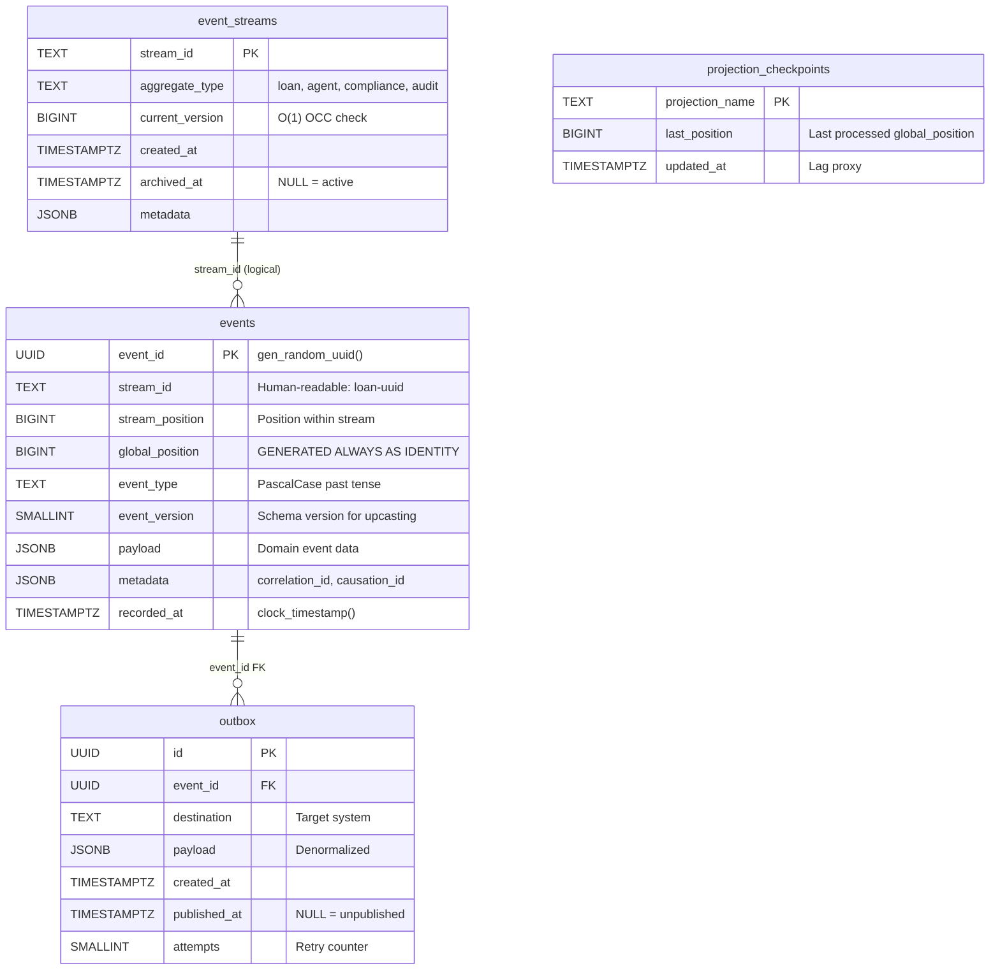
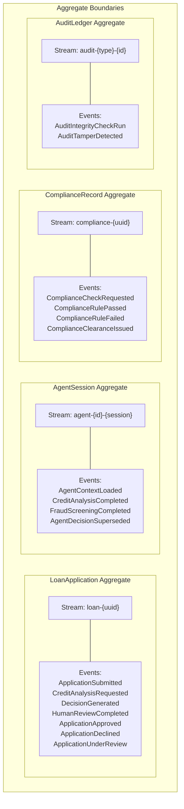
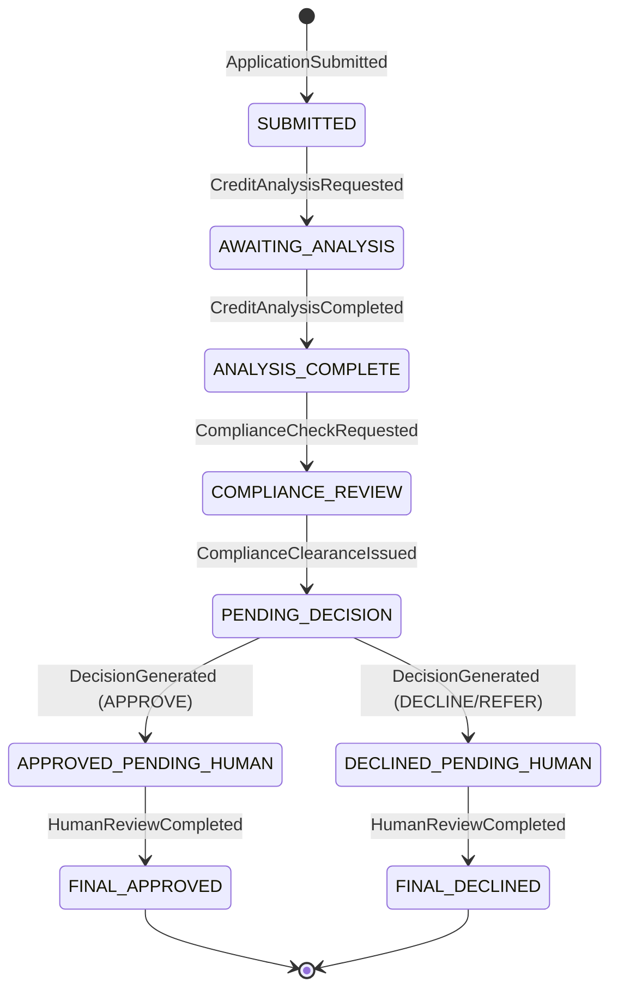
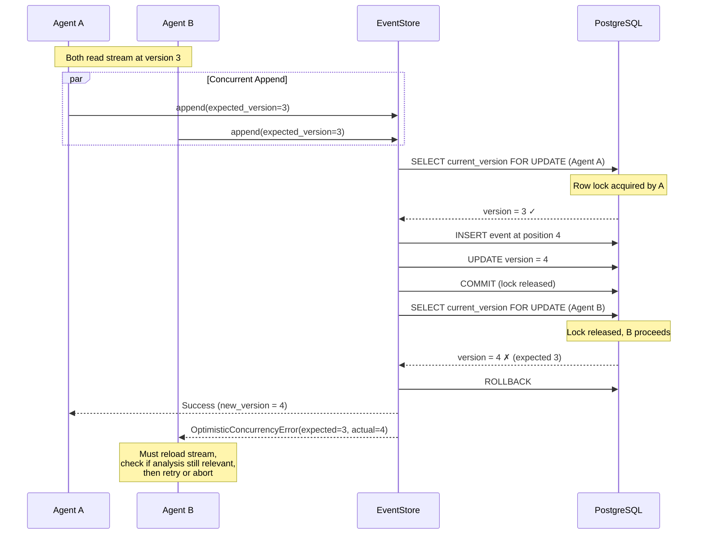

# TRP1 Ledger — Interim Submission Report

**Candidate Submission — Thursday 03:00 UTC Deadline**

---

## 1. DOMAIN_NOTES.md

*See [DOMAIN_NOTES.md](./DOMAIN_NOTES.md) for the complete Phase 0 written deliverable, covering all 6 required questions with specificity and Practitioner Manual references.*

---

## 2. Architecture Diagrams

### 2.1 Event Store Schema



### 2.2 Aggregate Boundaries & Stream Ownership



### 2.3 Command Flow — The 4-Step Handler Pattern

```mermaid
sequenceDiagram
    participant Client as AI Agent / API
    participant Handler as Command Handler
    participant Agg as Aggregate
    participant Store as EventStore
    participant DB as PostgreSQL

    Client->>Handler: SubmitApplicationCommand
    Note over Handler: Step 1 — Reconstruct State
    Handler->>Store: load_stream("loan-{id}")
    Store->>DB: SELECT ... FROM events WHERE stream_id = %s
    DB-->>Store: rows[]
    Store-->>Handler: StoredEvent[]
    Handler->>Agg: LoanApplicationAggregate.load(events)
    Note over Agg: Replay events → rebuild state

    Note over Handler: Step 2 — Validate Business Rules
    Handler->>Agg: assert_valid_transition()
    Agg-->>Handler: OK or DomainError

    Note over Handler: Step 3 — Determine New Events
    Handler->>Handler: Create ApplicationSubmitted event

    Note over Handler: Step 4 — Append Atomically
    Handler->>Store: append(stream_id, events, expected_version)
    Store->>DB: BEGIN TRANSACTION
    Store->>DB: SELECT current_version FOR UPDATE
    Store->>DB: INSERT INTO events (...)
    Store->>DB: UPDATE event_streams SET current_version
    Store->>DB: INSERT INTO outbox (...)
    Store->>DB: COMMIT
    DB-->>Store: new_version
    Store-->>Handler: new_version
    Handler-->>Client: Success(new_version)
```



### 2.4 LoanApplication State Machine



### 2.5 Double-Decision Concurrency — OCC Mechanism



---

## 3. Progress Summary

### What Is Working (Phase 1 + Phase 2)

**Phase 1 — Event Store Core ✅ Complete**

| Component | Status | Details |
|-----------|--------|---------|
| PostgreSQL Schema | ✅ | All 4 tables, 6 indexes (including BRIN), constraints, column-level justifications |
| `EventStore.append()` | ✅ | Atomic write with OCC, outbox in same transaction, metadata envelope |
| `EventStore.load_stream()` | ✅ | Position-bounded reads, optional upcaster support |
| `EventStore.load_all()` | ✅ | Async generator with batching, event type filtering |
| `EventStore.stream_version()` | ✅ | O(1) lookup via `event_streams` primary key |
| `EventStore.archive_stream()` | ✅ | Soft archive with `archived_at`, rejects future appends |
| `EventStore.get_stream_metadata()` | ✅ | Full `StreamMetadata` return |
| Double-Decision Test | ✅ | 2 concurrent tasks, exactly 1 succeeds, 1 gets OCC error, total = 4 events |

**Phase 2 — Domain Logic ✅ Complete**

| Component | Status | Details |
|-----------|--------|---------|
| `LoanApplicationAggregate` | ✅ | 9-state machine, event replay via `load()`, `_apply` pattern |
| `AgentSessionAggregate` | ✅ | Gas Town enforcement, model version checking |
| Business Rule 1 (State machine) | ✅ | `VALID_TRANSITIONS` map, `InvalidStateTransitionError` |
| Business Rule 2 (Gas Town) | ✅ | `assert_context_loaded()` — no decisions without context |
| Business Rule 3 (Model lock) | ✅ | `assert_model_version_current()` |
| Business Rule 4 (Confidence floor) | ✅ | `confidence_score < 0.6 → REFER` enforced in aggregate |
| Command Handlers | ✅ | `handle_submit_application`, `handle_credit_analysis_completed`, and more |
| Event Catalogue | ✅ | All 13 catalogue events + 4 identified missing events |

### Test Results

All 6 tests pass:

```
tests/test_concurrency.py::test_double_decision_concurrency    PASSED  [ 16%]
tests/test_concurrency.py::test_new_stream_creation            PASSED  [ 33%]
tests/test_concurrency.py::test_stream_version_nonexistent     PASSED  [ 50%]
tests/test_concurrency.py::test_load_stream_empty              PASSED  [ 66%]
tests/test_concurrency.py::test_metadata_contains_correlation_id PASSED [ 83%]
tests/test_concurrency.py::test_archive_stream                 PASSED  [100%]

======================== 6 passed in ~7s ========================
```

Tests use `testcontainers` to spin up a PostgreSQL 16 instance in Docker — no external database setup required.

---

## 4. Concurrency Test Results

The **Double-Decision Concurrency Test** (the MANDATORY test from Challenge Doc Phase 1 p.8) passes with all 3 required assertions:

- **(a)** Total events in stream after both tasks = **4** (not 5) ✅
- **(b)** Winning task's event has `stream_position = 4` ✅
- **(c)** Losing task raises `OptimisticConcurrencyError` — not silently swallowed ✅

Additional assertions verified:
- Error contains `stream_id`, `expected_version = 3`, `actual_version = 4`
- Error includes `suggested_action = "reload_stream_and_retry"` (for LLM consumers)
- Stream positions after test: `[1, 2, 3, 4]` — no gaps, no duplicates

The test uses `anyio.create_task_group()` (not `asyncio.gather()`) as specified in the challenge doc.

---

## 5. Known Gaps & Plan for Final Submission

### Phase 3 — Projections & Async Daemon (Not Started)

| Deliverable | Plan |
|-------------|------|
| `src/projections/daemon.py` | `ProjectionDaemon` with fault-tolerant batch processing, per-projection checkpoints, `get_lag()` |
| `src/projections/application_summary.py` | One row per application, upsert-based, SLO < 500ms lag |
| `src/projections/agent_performance.py` | Metrics per agent model version (rate, duration, confidence) |
| `src/projections/compliance_audit.py` | Temporal query support with `get_compliance_at(app_id, timestamp)`, snapshot strategy |
| `tests/test_projections.py` | Lag SLO tests under simulated load of 50 concurrent handlers |

### Phase 4 — Upcasting, Integrity & Gas Town (Not Started)

| Deliverable | Plan |
|-------------|------|
| `src/upcasting/registry.py` | `UpcasterRegistry` with automatic version chain on load |
| `src/upcasting/upcasters.py` | `CreditAnalysisCompleted` v1→v2, `DecisionGenerated` v1→v2 |
| `src/integrity/audit_chain.py` | SHA-256 hash chain, tamper detection |
| `src/integrity/gas_town.py` | `reconstruct_agent_context()` with token budget |
| `tests/test_upcasting.py` | Immutability test (stored payload unchanged after upcast) |
| `tests/test_gas_town.py` | Simulated crash recovery test |

### Phase 5 — MCP Server (Not Started)

| Deliverable | Plan |
|-------------|------|
| `src/mcp/server.py` | MCP server entry point |
| `src/mcp/tools.py` | 8 tools (command side) with structured error types |
| `src/mcp/resources.py` | 6 resources (query side) reading from projections |
| `tests/test_mcp_lifecycle.py` | Full loan lifecycle via MCP tools only |

### Phase 6 — Bonus (If Time Permits)

| Deliverable | Plan |
|-------------|------|
| `src/what_if/projector.py` | Counterfactual projection with causal dependency filtering |
| `src/regulatory/package.py` | Self-contained JSON examination package |

### DESIGN.md (Required for Final)

Will contain 6 required sections: aggregate boundary justification, projection strategy, concurrency analysis, upcasting inference decisions, EventStoreDB comparison, and "what you would do differently."

### Priority Order for Final Submission

1. **Phase 3** (Projections) — highest rubric weight remaining
2. **Phase 4** (Upcasting + Integrity) — demonstrates immutability understanding
3. **Phase 5** (MCP Server) — completes the interface layer
4. **DESIGN.md** — assessed with equal weight to code
5. **Phase 6** (Bonus) — only if Phases 3–5 are solid
